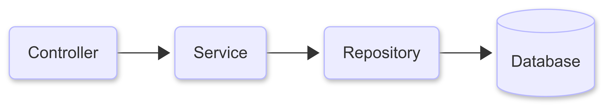
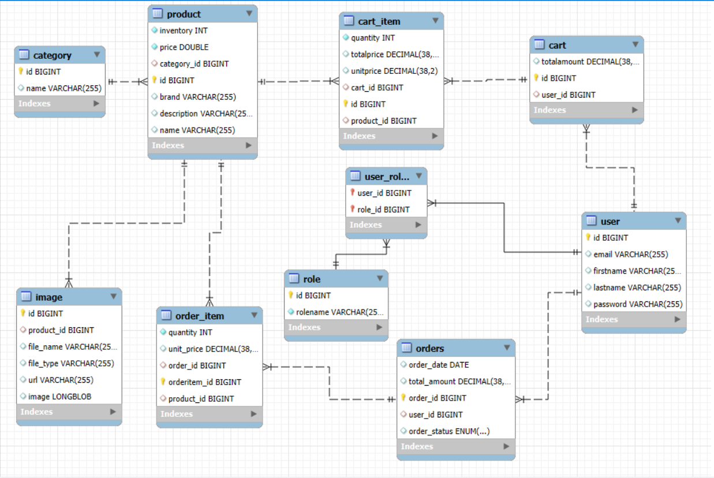
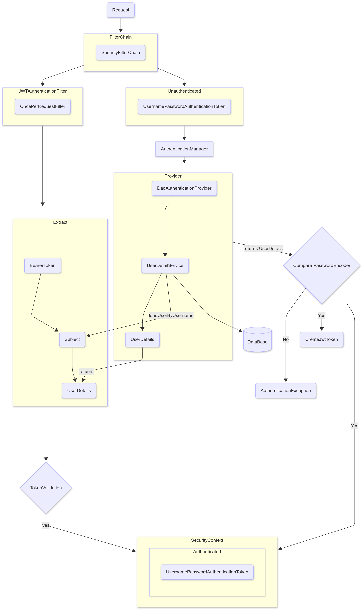

# Ecommerce Backend API 🛒

- A Spring Boot Rest API for Ecommerce Platform
- Features are secure using JWT authentication, role-based access control (Admin/User), and full cart and product management.

## Features

- Used Authentication With JWT (Register , Login)
- Role Based Authorization (USER , ADMIN)
- Product Management , Category Management (ADMIN)
- Cart Management , Order Management (USER)

## Tech Stack

**Backend:** Spring Boot 3.5,Spring Security(JWT),Hibernate,JPA              
**Database:** MYSQL   
**Build Tool:** Maven  
**Testing:** Postman

## 🏗️Spring HighLevel Architecture

## 🗄️DataBase Design

## 🛡️Spring Security Design

## 📬 Postman Collection

You can test all the APIs using Postman.  
Download the collection here:  
👉 [Ecommerce API Collection](./ApiDocs/ECommerce.postman_collection.json)